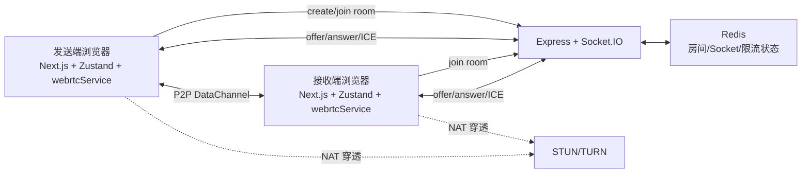

# PrivyDrop 架构与实现原理学习笔记

更新时间：2026-04-12  
研究对象：`https://github.com/david-bai00/PrivyDrop`  
代码快照来源：本地临时目录 `D:\ovo\Documents\Tian\AeroDrop\.tmp-privydrop`  
说明：这是一份本地分析文档，仅保存在当前工作区，不做提交或上传。

## 1. 先说结论

PrivyDrop 的核心价值不在“把文件从前端传到后端”，而在于把后端压缩成一个极薄的信令与房间协调层，把真正的数据传输、断线恢复、磁盘写入、进度统计都放到浏览器端完成。

它的整体思路可以概括成 4 句话：

1. 前端用 Next.js 提供页面、状态管理和交互外壳。
2. 后端只负责房间创建、Socket.IO 信令转发、Redis 状态存储和限流。
3. 真正的文件与文本内容通过 WebRTC DataChannel 在浏览器之间点对点传输。
4. 为了支持大文件、断点续传和多接收端，它把发送端和接收端都拆成了更细的编排器模块，而不是把所有逻辑塞进一个类里。

这套架构的优点很清晰：

- 隐私性强：业务服务器不接触文件内容。
- 成本低：后端不承担文件带宽。
- 扩展性好：后端无状态，状态落 Redis。
- 用户体验相对完整：支持文件夹、多接收端、续传、磁盘直写、分享链接和二维码。

它的主要前提也很明确：

- 必须依赖浏览器 WebRTC 能力。
- 复杂网络环境下最好配 TURN。
- 大文件体验高度依赖浏览器对 File System Access API 和 DataChannel 的支持。

---

## 2. 系统总览

### 2.1 组件分层

PrivyDrop 可以拆成 5 个运行时角色：

1. 前端页面层：Next.js App Router 页面、营销页、博客页、多语言路由。
2. 前端应用层：`ClipboardApp`、Hooks、Zustand Store、`webrtcService` 单例。
3. WebRTC 连接层：`BaseWebRTC`、`WebRTC_Initiator`、`WebRTC_Recipient`。
4. 传输编排层：发送端 `FileTransferOrchestrator`，接收端 `FileReceiveOrchestrator`。
5. 服务端协调层：Express API、Socket.IO、Redis、可选 Nginx / TURN。

### 2.2 拓扑图



### 2.3 一句话理解它的运行边界

- 服务端负责“让双方认识并建立连接”。
- 浏览器负责“真正发送和接收内容”。

---

## 3. 仓库结构与职责划分

### 3.1 顶层目录

- `frontend/`：Next.js 前端应用。
- `backend/`：Express + Socket.IO + Redis 的信令服务。
- `docs/`：官方架构和部署文档。
- `docker/`：Nginx、SSL、Coturn 等部署配置。
- `docker-compose.yml`：本地或服务器容器编排。
- `deploy.sh`：一键部署脚本。

### 3.2 前端目录重点

- `frontend/app/`：App Router 页面、布局、i18n 路由、运行时配置。
- `frontend/components/`：页面组件和 Clipboard 主应用 UI。
- `frontend/hooks/`：业务逻辑层，负责房间、连接、文件传输、消息提示等。
- `frontend/lib/`：核心库，包含 WebRTC 封装、文件发送接收、工具函数。
- `frontend/lib/transfer/`：发送编排模块。
- `frontend/lib/receive/`：接收编排模块。
- `frontend/stores/fileTransferStore.ts`：Zustand 全局状态。
- `frontend/types/webrtc.ts`：控制消息协议和文件相关类型定义。

### 3.3 后端目录重点

- `backend/src/server.ts`：Express 与 Socket.IO 启动入口。
- `backend/src/routes/api.ts`：房间 API、日志、埋点、离房接口。
- `backend/src/socket/handlers.ts`：Socket.IO 事件处理，核心信令转发在这里。
- `backend/src/services/room.ts`：Redis 房间读写封装。
- `backend/src/services/rateLimit.ts`：基于 Redis Sorted Set 的限流。
- `backend/src/services/redis.ts`：Redis 单例连接。

---

## 4. 前端架构：UI、状态、连接和传输如何解耦

### 4.1 前端核心设计思想

PrivyDrop 前端最值得学习的点，是它没有把 WebRTC 逻辑直接写进 React 组件，而是做了 3 层拆分：

1. 展示层：组件只负责展示和用户输入。
2. 业务层：Hooks 负责业务流程编排。
3. 基础能力层：`lib/` 负责 WebRTC、消息协议、文件读写、性能优化。

这样做的好处是：

- UI 改版时，不会把连接逻辑一起打碎。
- WebRTC 连接与传输逻辑可以脱离 React 生命周期独立存在。
- 复杂状态可以被 Store 和单例服务接住，避免页面切换时丢状态。

### 4.2 `ClipboardApp` 是页面协调器，不是业务中心

核心入口在 `frontend/components/ClipboardApp.tsx`。

它做的事情主要有：

- 挂载 `useRoomManager`、`useWebRTCConnection`、`useFileTransferHandler`。
- 根据当前 Tab 渲染发送面板和接收面板。
- 监听全局拖拽，把拖入窗口的文件统一交给 `traverseFileTree` 和文件处理逻辑。
- 在接收页自动读取缓存 room id，并尝试自动加入房间。

这里的关键取舍是：组件本身几乎不理解 WebRTC 细节，只负责拼装各种 Hook 暴露出来的状态和操作。

### 4.3 Zustand Store 负责“共享状态”，单例 service 负责“长生命周期连接”

状态统一放在 `frontend/stores/fileTransferStore.ts`，包含：

- 房间状态：`shareRoomId`、`shareLink`、房间状态文案。
- 连接状态：发送端 / 接收端连接状态、房间内人数、断线标记。
- 传输状态：待发送文本、待发送文件、已接收文件、元数据、发送/接收进度。
- UI 状态：当前 tab、拖拽状态、输入框值、消息提示。

同时，`frontend/lib/webrtcService.ts` 通过单例模式持有：

- `WebRTC_Initiator`
- `WebRTC_Recipient`
- `FileSender`
- `FileReceiver`

这个组合很关键。它意味着：

- 页面路由切换不会天然销毁连接对象。
- 同一浏览器标签页内的导航不会中断正在进行的传输。
- React 组件可以重渲染，但真正的连接和传输器仍然活着。

这也是官方文档里强调的 “in-app navigation persistence” 的真实实现基础。

---

## 5. 建房、入房、握手、传输：主链路怎么跑

### 5.1 建房

发送端初始化时，`useRoomManager` 会调用 `fetchRoom()` 请求后端 `GET /api/get_room`。

后端在 `backend/src/routes/api.ts` 中：

- 生成短房间号。
- 调用 `roomService.createRoom(roomId)`。
- 在 Redis 中写入房间 Hash 和对应 Socket Set 的 TTL。

如果用户输入自定义房间号，前端会先调用 `POST /api/check_room` 检查可用性，再通过 `POST /api/create_room` 创建。

一个特殊设计是：

- 短房间号保持严格唯一，防冲突。
- 长房间号在已存在时允许“重连复用”，这明显是为缓存 ID / 重连场景准备的。

### 5.2 入房

前端调用 `webrtcService.joinRoom(roomId, isSender, forceInitiatorOnline)`。

底层实际走的是 `BaseWebRTC.joinRoom()`：

- 通过 Socket.IO 发 `join`。
- 等待 `joinResponse`。
- 同时监听等价成功信号。
  - 发送端监听 `ready` / `recipient-ready`
  - 接收端监听 `offer`
- 设置 15 秒超时，避免弱网下无限等待。

这一步说明作者已经意识到，真实网络里“加入房间成功”和“开始握手”不一定严格按单一路径发生，所以加入逻辑做了冗余成功判定。

### 5.3 WebRTC 握手

角色分工很清楚：

- `WebRTC_Initiator`：发送端，负责建 `RTCPeerConnection`、创建 `RTCDataChannel`、发 `offer`。
- `WebRTC_Recipient`：接收端，收到 `offer` 后建连接、挂 `ondatachannel`、回 `answer`。

完整信令过程：

1. 接收端 join 房间。
2. 后端 `socket.to(roomId).emit("ready", { peerId })` 通知房间内其他成员。
3. 发送端收到 `ready`，创建 peer connection 和 data channel。
4. 发送端创建 `offer`，经服务端转发给接收端。
5. 接收端设置 remote description，创建 `answer`，再经服务端转发回发送端。
6. 双方持续交换 `ice-candidate`。
7. WebRTC 建立 P2P 通道。

后端在 `backend/src/socket/handlers.ts` 对 `offer`、`answer`、`ice-candidate` 的处理完全是“转发器”角色，不解析内容、不落盘。

### 5.4 真正的数据传输

数据通道建立后，服务端就退出了“数据传输主路径”。

之后发生的是：

- 文本通过 DataChannel 发 JSON 分片。
- 文件先发 `fileMeta` 元数据。
- 接收端点击下载或下载文件夹后，再主动发 `fileRequest`。
- 发送端按需读取文件并以二进制 chunk 发送。

也就是说，它不是“发送端一连上就把所有文件推过去”，而是“先广播可下载内容，再由接收端按需拉取”。这是非常重要的实现选择，因为它天然适合：

- 多接收端并发。
- 某个接收端掉线后单独恢复。
- 文件夹里的文件逐个请求。
- 不必在发送端为每个接收端维护完全同步的下载时机。

---

## 6. WebRTC 连接层：为什么它能支持多接收端和自动重连

### 6.1 `BaseWebRTC` 是真正的连接底座

`frontend/lib/webrtc_base.ts` 管了几乎所有连接通用能力：

- Socket.IO 连接和公共事件监听。
- `peerConnections: Map<string, RTCPeerConnection>`。
- `dataChannels: Map<string, RTCDataChannel>`。
- ICE candidate 排队与补发。
- 连接状态变化处理。
- `socket.id` 变化后的自动重新入房。
- P2P 断开后的自动重连尝试。
- Wake Lock 管理，减少移动端锁屏/后台导致的中断。

这份代码的核心思想是：一个浏览器不是只维护一个 peer，而是维护一组 `peerId -> connection` 映射。

这就是它支持多接收端的根基。

### 6.2 多接收端支持是怎么做出来的

多接收端不是靠后端广播文件，而是靠发送端同时维护多条 WebRTC 连接。

证据非常直接：

- `sender.peerConnections` 是一个 `Map`。
- `broadcastDataToAllPeers()` 会遍历所有 peer。
- `sendProgress` 和 `receiveProgress` 结构是 `fileId -> peerId -> progress`。

所以一个房间里：

- 新接收端加入时，服务端只发一个 `ready` 给发送端。
- 发送端为这个新 peer 单独创建连接和 data channel。
- 已有接收端不会被打断。
- 新接收端只会从自己的请求点开始拉取文件。

这是一种非常自然的“单发送者，多消费者”拓扑。

### 6.3 重连是怎么做的

这个项目对重连做了不少工程化处理：

- 记录 `lastJoinedSocketId`，如果 socket 重连后 id 变化，会自动重新 join 房间。
- `disconnect`、`failed`、`closed` 都会触发 `attemptReconnection()`。
- 发送端可主动发 `initiator-online`。
- 接收端收到后回 `recipient-ready`，触发新一轮握手。
- 本地可缓存 room id，切到接收页时自动尝试加入。

这说明作者把“页面刷新之外的临时中断恢复”作为重要体验目标。

---

## 7. 文件传输协议：不是裸发 Blob，而是分成控制消息和嵌入式 chunk 包

### 7.1 控制消息协议

`frontend/types/webrtc.ts` 定义了消息协议，主要包括：

- `fileMeta`：文件元数据。
- `fileRequest`：接收端请求某个文件，可携带 `offset` 续传偏移。
- `stringMetadata`、`string`：文本传输。
- `fileReceiveComplete`：单文件接收完成确认。
- `folderReceiveComplete`：文件夹接收完成确认。

这说明它把 DataChannel 上的数据分成两类：

- JSON 控制消息。
- 二进制文件数据。

### 7.2 文件发送不是直接 `file.arrayBuffer()` 一次性塞出去

发送侧 `FileSender` 已经被重构成兼容层，真正工作的是 `frontend/lib/transfer/FileTransferOrchestrator.ts`。

发送流程大致是：

1. 广播 `fileMeta`。
2. 接收端发 `fileRequest(fileId, offset)`。
3. 发送端根据 `fileId` 找到待发送文件。
4. `StreamingFileReader` 从指定 `offset` 开始读取。
5. `NetworkTransmitter` 做背压控制后发送。
6. `ProgressTracker` 更新 per-peer 进度。
7. 接收端完成后回 `fileReceiveComplete`。

### 7.3 大文件发送优化：32MB 批量读 + 64KB 网络块发送

`StreamingFileReader` 的做法值得重点学习：

- 读取层按 32MB batch 读文件。
- 网络层按 64KB chunk 发送。

这样做的目的不是炫技，而是兼顾两件事：

1. 降低频繁 `FileReader` 读取的小块开销。
2. 让 DataChannel 发送粒度维持在浏览器更稳定的范围内。

换句话说，它把“磁盘/文件读取粒度”和“网络发送粒度”分开了。

这是一个很成熟的工程思路。

### 7.4 大文件发送优化：利用 DataChannel 原生背压

`NetworkTransmitter` 没有盲发，而是使用：

- `bufferedAmount`
- `bufferedAmountLowThreshold`
- `bufferedamountlow` 事件

当通道缓冲过大时，它会等待缓冲下降再继续发。

这能避免：

- 内存持续上涨。
- 浏览器主线程被大数据持续压垮。
- DataChannel 因积压过大而更容易失败。

### 7.5 二进制包格式：元数据和 chunk 融合

项目采用了一个自定义二进制包结构：

```text
[4 bytes metadata length] + [JSON metadata] + [chunk binary]
```

元数据里带：

- `chunkIndex`
- `totalChunks`
- `chunkSize`
- `isLastChunk`
- `fileOffset`
- `fileId`

这个设计的目的，是让每个 chunk 自描述，接收端不依赖额外上下文就能知道：

- 这是哪个文件的哪一块。
- 这是绝对第几个 chunk。
- 是否已经到末尾。

README 和代码注释里提到它还特别是为了修正 Firefox 相关的乱序问题。

---

## 8. 接收端设计：为什么它既能存内存，又能直接写磁盘，还支持续传

### 8.1 接收端不是只会把所有 chunk 拼成 Blob

`FileReceiveOrchestrator` 负责接收主流程，它根据文件大小和浏览器能力，走两条不同路径：

1. 小文件：内存拼装后生成 Blob。
2. 大文件：直接流式写到用户选择的目录。

这背后的判断在 `ReceptionConfig.shouldSaveToDisk(...)`。

### 8.2 续传的核心不是“记住上次传到哪”，而是“用磁盘已有大小反推出 offset”

接收端如果已经设置保存目录，会在请求下载前：

- 通过 `StreamingFileWriter.getPartialFileSize()` 获取本地已存在文件大小。
- 如果发现已有部分内容，则以此作为 `offset` 发 `fileRequest`。

发送端收到后：

- `StreamingFileReader(file, offset)` 从指定偏移继续读。

也就是说，这个项目的续传是“接收端驱动”的：

- 接收端决定从哪里继续。
- 发送端只是按 offset 继续读取。

这比在服务端维护断点状态更轻量，也更符合它的无状态后端设计。

### 8.3 磁盘直写的关键：顺序写管理器

`StreamingFileWriter.ts` 中的 `SequencedDiskWriter` 是一个很关键的模块。

它解决的是：

- WebRTC chunk 到达顺序可能不绝对稳定。
- 写磁盘时希望顺序、连续、可恢复。

它的做法是：

- 维护 `nextWriteIndex`。
- 如果收到的是当前期待 chunk，立刻写。
- 如果收到的是未来 chunk，先放进 `writeQueue`。
- 一旦缺失 chunk 到达，就顺序 flush 后续已缓存 chunk。

这个模式本质上是“有序写缓冲器”。

它的意义很大：

- 让乱序网络到达不会立刻破坏文件。
- 让续传场景可以从准确 chunk 边界继续。
- 在最终 `close()` 时还能补刷剩余 chunk。

### 8.4 文件夹传输的本质是“文件集合”，不是一个真的文件夹流

文件夹支持不是通过某种特殊协议直接发送目录树，而是：

- 每个文件仍然独立发送元数据和内容。
- `folderName`、`fullName` 用来恢复目录结构。
- 接收端根据 `fullName` 在本地创建目录结构。
- 文件夹完成后再发送 `folderReceiveComplete`。

所以“文件夹传输”其实是“带路径信息的多文件传输”。

---

## 9. 后端架构：为什么可以做到很薄

### 9.1 后端本质是 WebRTC 的辅助平面

后端从一开始就没有参与文件内容传输，它只承担三类职责：

1. 房间管理。
2. 信令转发。
3. 限流和一些辅助 API。

因此它可以非常轻：

- Express 处理 HTTP API。
- Socket.IO 处理实时信令。
- Redis 保存临时状态。

### 9.2 Redis 数据模型

`backend/src/services/room.ts` 定义的数据结构很清晰：

- `room:<roomId>`：Hash，存房间元信息。
- `room:<roomId>:sockets`：Set，存房间中的 socket id。
- `socket:<socketId>`：String，反向映射 socket 属于哪个房间。
- `ratelimit:join:<ip>`：Sorted Set，做 join 限流。
- `referrers:daily:<date>`：Hash，做来源统计。

这是一个典型的“用 Redis 原生数据结构表达业务关系”的实现，优点是：

- 查询简单。
- TTL 好做。
- 不需要关系数据库。

### 9.3 房间生命周期管理

房间不是永久的：

- 创建时有 TTL。
- join 时会 refresh TTL。
- 用户断开后如果房间空了，会把过期时间缩短到 15 分钟。

这能平衡两个目标：

- 避免死房间长期占用状态。
- 又给短时间重连留窗口。

### 9.4 信令转发逻辑很克制

`backend/src/socket/handlers.ts` 中：

- `join`：校验房间存在、绑定 socket 到房间、发 `joinResponse`、广播 `ready`。
- `offer` / `answer` / `ice-candidate`：直接 `socket.to(data.peerId).emit(...)`。
- `initiator-online` / `recipient-ready`：用于重连场景的额外握手信号。
- `disconnect`：解绑 socket、通知其他 peer、清理房间成员。

也就是说，后端知道“谁在房间里”和“消息要转发给谁”，但不知道文件内容。

这正是 P2P 产品里非常典型的职责边界。

### 9.5 限流设计

`checkRateLimit()` 使用 Redis Sorted Set：

- 每次 join 记录当前时间戳。
- 删除窗口外数据。
- 统计窗口内请求数。

当前窗口是 5 秒，允许 2 次。

这个限流不复杂，但对公开服务已经足够拦掉最粗糙的滥用。

---

## 10. 部署拓扑：它不是只跑前后端两个进程

`docker-compose.yml` 展示了完整的推荐部署拓扑：

- `frontend`：Next.js 应用。
- `backend`：Express + Socket.IO 服务。
- `redis`：房间和限流状态。
- `nginx`：反向代理、同源转发、HTTPS。
- `coturn`：可选 TURN/STUN 服务，解决复杂 NAT 穿透。

这里有两个很重要的工程选择：

1. 前后端最好通过 Nginx 做同源代理，减少浏览器跨域和 Socket.IO 路径问题。
2. 公网部署时 TURN 基本是“提高成功率的必要条件”，不是锦上添花。

这说明作者不是把它当成只在本机演示的玩具，而是认真考虑了实际部署问题。

---

## 11. 这个项目最值得借鉴的实现点

### 11.1 用单例服务承接 React 之外的长生命周期连接

如果一个前端应用有：

- WebRTC
- WebSocket
- 长时间文件传输
- 后台恢复

那把核心连接对象放在 React 组件里通常会比较脆弱。PrivyDrop 用 `webrtcService` 单例承接这部分生命周期，是很稳妥的做法。

### 11.2 接收端驱动下载，非常适合多接收端

它不是发送端一股脑推文件，而是：

- 发送端发布元数据。
- 接收端按需请求。

这个结构天然支持多接收端并行，而且每个接收端都能独立续传。

### 11.3 把文件读取、网络发送、进度统计拆成独立模块

发送端的 `FileTransferOrchestrator + StreamingFileReader + NetworkTransmitter + ProgressTracker`，以及接收端的对应拆法，都说明作者已经从“功能能跑”进化到“模块边界可维护”。

这类拆分对后续优化很有价值：

- 可以单独换 chunk 大小策略。
- 可以单独调整背压逻辑。
- 可以单独优化接收端写盘。

### 11.4 用 Redis TTL 管临时房间，比数据库表更贴合场景

这是一个典型的临时状态场景。房间天然短生命周期，用 Redis 比数据库更自然，也更省维护成本。

---

## 12. 可能的局限和后续优化方向

从当前实现看，也有一些边界和潜在优化点：

### 12.1 服务端仍是单点信令入口

虽然状态在 Redis 里，但当前代码没有展示多实例 Socket.IO 的横向广播适配，例如 Redis adapter。  
如果未来要真正多实例横向扩展，需要补上 Socket.IO 的跨实例适配层。

### 12.2 续传主要依赖本地文件大小，不是更强的一致性校验

它目前更像“按大小续传”，而不是“按 chunk hash 校验续传”。  
如果遇到本地部分文件损坏，理论上还缺少更强的一致性验证手段。

### 12.3 浏览器能力差异会影响完整体验

例如：

- File System Access API 不是所有浏览器都一样稳定。
- DataChannel 在不同浏览器上的行为差异仍然需要兼容层。
- 移动端后台切换和锁屏仍然是高风险场景。

### 12.4 目前的权限与角色模型比较简单

从代码看，房间更像“知道 roomId 就能加入”，没有额外认证或访问控制。  
这对隐私型临时分享足够轻便，但如果做更强安全模型，还可以引入：

- 一次性 token
- 房主确认
- 端到端额外应用层加密口令

---

## 13. 对我理解 AeroDrop 这类项目的启发

如果把 PrivyDrop 当作参考样板，它最值得迁移的不是 UI，而是下面这些架构思路：

1. 用“极薄后端 + 浏览器 P2P”降低服务端成本。
2. 用“单例连接服务 + Zustand”保证页面切换不断传。
3. 用“接收端请求文件”的协议支持多接收端和续传。
4. 用“批量读 + 小块发 + 背压控制”稳定大文件传输。
5. 用“磁盘顺序写队列”把浏览器端续传做得更可靠。

如果你的目标是继续演进当前 `AeroDrop`，PrivyDrop 更像一个很好的“浏览器端 P2P 传输工程化范本”。

---

## 14. 关键代码索引

### 前端主入口与状态

- `frontend/components/ClipboardApp.tsx`
- `frontend/hooks/useRoomManager.ts`
- `frontend/hooks/useWebRTCConnection.ts`
- `frontend/hooks/useFileTransferHandler.ts`
- `frontend/stores/fileTransferStore.ts`
- `frontend/lib/webrtcService.ts`

### WebRTC 与连接管理

- `frontend/lib/webrtc_base.ts`
- `frontend/lib/webrtc_Initiator.ts`
- `frontend/lib/webrtc_Recipient.ts`
- `frontend/app/config/environment.ts`

### 发送链路

- `frontend/lib/fileSender.ts`
- `frontend/lib/transfer/FileTransferOrchestrator.ts`
- `frontend/lib/transfer/StreamingFileReader.ts`
- `frontend/lib/transfer/NetworkTransmitter.ts`
- `frontend/lib/transfer/MessageHandler.ts`

### 接收链路

- `frontend/lib/fileReceiver.ts`
- `frontend/lib/receive/FileReceiveOrchestrator.ts`
- `frontend/lib/receive/MessageProcessor.ts`
- `frontend/lib/receive/StreamingFileWriter.ts`

### 后端

- `backend/src/server.ts`
- `backend/src/routes/api.ts`
- `backend/src/socket/handlers.ts`
- `backend/src/services/room.ts`
- `backend/src/services/rateLimit.ts`
- `backend/src/services/redis.ts`

---

## 15. 最后一句总结

PrivyDrop 的架构本质上是：

“用一个很轻的 Node.js + Redis 信令后端，把浏览器变成真正的文件传输节点，再通过单例连接服务、模块化传输编排和磁盘直写，把 WebRTC 文件分享从 demo 做到接近可长期维护的产品形态。”
